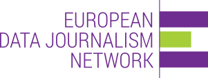

# EDJNet 2 webinar : open data journalism (working title)

This webinar is organized and funded by [the European datajournalism newtork (EDJNet)](https://www.europeandatajournalism.eu/). The preparation, presentation and documentation are produced by [Datactivist](https://datactivist.coop/).

## Webinar

### Event

The webinar is scheduled on Tuesday December 10th from 4 PM to 5:30 PM CET.

Attendance is free and open.

### Trainer
- Sylvain Lapoix, datajournalist & trainer at ([Datactivist](https://datactivist.coop/))

### Participants

* provided upon release.

### Program

This webinar will feature :
* lots of good reasons to open your data (and your journalism) ;
* some examples of productive and efficient ways other journalists do it (but not only journalists) ;
* methods and tools to make it happen ;
* a hands-on exercise to get you started in sharing the facts and figures.

The detail will be provided upon release.

------

## Documentation

### Presentation

The full presentation will be available in HTML format at this address : [datactivist.coop/edjnet_opendatajournalism/webinar/](https://datactivist.coop/edjnet_opendatajournalism/webinar/).

### Q&A

A summary of the questions asked and answered provided will be published after the webinar.

### References

The full list of the papers, websites, shows and publications mentionned in the presentation :

* provided upon release.

### Bibliography

A comprehensive selection of documentation, tutorials and references to help you open your data and methods by using the best practices :

* provided upon release.